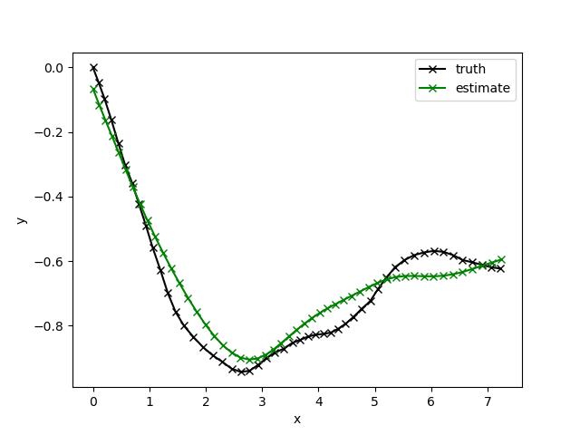
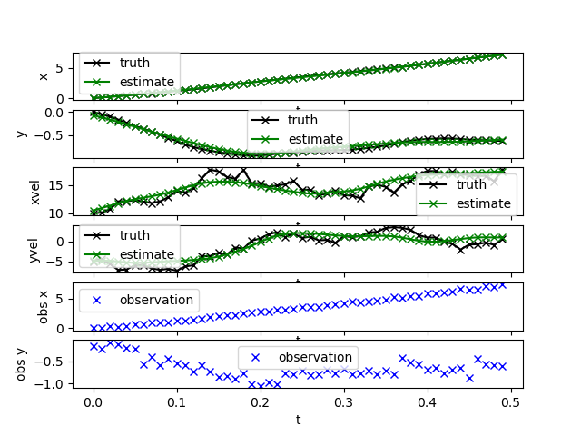

# adskalman-examples

Examples for the `adskalman` crate.

### Running the examples

Run the the examples like so:

```
cd examples
cargo run --bin online_tracking
```

### What examples are here? In the `src/bin` directory are:

- `online_tracking.rs` Start here. Use of a linear Kalman filter at each step of
  a timeseries.
- `nonlinear_observation.rs` Use of a nonlinear observation model.
- `offline_filtering.rs` Use of a linear Kalman filter for entire timeseries at
  once.
- `offline_smoothing.rs` Use of a linear Kalman filter with a forward and a
  backward pass over entire timeseries to implement Rauch-Tung-Striebel
  smoothing.

How to run the examples and view the results. This is for the
`offline_smoothing` example. Substitute the name for any of the examples above:

```
# Compile and run the example on linux or mac:
cargo run --bin offline_smoothing > results.csv

# Compile and run the example on Windows:
cargo run --bin offline_smoothing | Out-File -FilePath results.csv -Encoding utf8

# View the results (requires Python with Pandas and Matplotlib)
python .\plot_csv.py .\results.csv
```

The results should like something like this:




